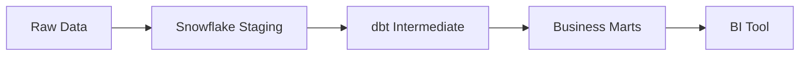

# 📊 TPC-H Analytics Pipeline: Snowflake + dbt + Airflow
## 🚀 Project Overview
This project implements a robust, containerized ELT pipeline using the Modern Data Stack.
It transforms raw TPC-H data into business-ready dimensions and facts.
The focus of this project was on implementing production-grade features: layered data modelling, automated testing, and orchestrated scheduling via Airflow.



# 🛠 Tech Stack
**Data Warehouse:** Snowflake (Storage and Compute)

**Transformation:** dbt Core (v1.11.4)

**Orchestration:** Apache Airflow (via Astronomer Cosmos)

**Infrastructure:** Docker (Containerized Environment)

**Language:** SQL & Python

# 📐 Data Architecture & Lineage
The project follows a modular, three-layer architecture to ensure data quality and scalability:

**1. Staging Layer:** Raw data ingestion, casting, and renaming.

**2. Intermediate Layer:** Complex business logic and shipping performance calculations.

**3. Mart Layer:** Final Fact and Dimension tables optimized for BI tools like Lightdash.


# ⚙️ Key Engineering Features
## 1. Advanced Orchestration with Cosmos
Instead of treating DBT as a "black box," I utilized Astronomer Cosmos to render DBT models as native Airflow tasks. This provides:

Task-level visibility into failures.

The ability to run tests immediately after specific model builds.


## 2. Production-Grade Reliability
**Retries:** Tasks are configured with a 5-minute retry delay to handle transient Snowflake connection issues.

**Error Handling:** Implemented a custom dag_failure_callback that triggers automated email alerts upon task failure.

**Schema Governance:** Used a custom generate_schema_name macro to manage dynamic schema environments (Staging, Intermediate, Mart) in Snowflake.<br />
For this example, I created another schema for the models. <br />
<br />

 - Staging and Intermediate models will persist in the TPCH_PROD: <br />
<br />
- Snapshots in the Snapshot schema and Fact and Dim tables in Mart schema: <br />


## 3. Automated Data Quality
Over 15 data tests are embedded in the pipeline, including:

**Generic Tests:** unique, not_null, and relationships.

**Custom Tests:** accepted_range from dbt_utils to validate shipping durations.

## 4. Self-Documenting Metadata
Descriptions and Primary Key definitions are maintained in YAML and persisted directly into Snowflake as object comments, ensuring the data dictionary is always accessible to analysts.

# 🚦 Getting Started

### Clone the repository:
```
git clone https://github.com/angelinauesato/tpch_snowflake_project.git
```
### Snowflake Configuration:
Before running the pipeline, you must set up the necessary infrastructure in Snowflake. 

1. Log in to your Snowflake console.
2. Open a new SQL Worksheet.
3. Open the script and update with your user where you see: <YOUR_USER> [scripts/snowflake_setup.sql](./scripts/snowflake_setup.sql)<br />
  3.1.   You can run to see the user: SELECT CURRENT_USER();
4. Run the contents of [scripts/snowflake_setup.sql](./scripts/snowflake_setup.sql).
5. Configure Environment Variables:
   Create a **.env** file with your Snowflake credentials (Account, User, Password, Role, Warehouse).

Spin up the stack:

```
docker compose up -d
```
Access the UI:

Airflow: http://localhost:8080

dbt Docs: http://localhost:8081
